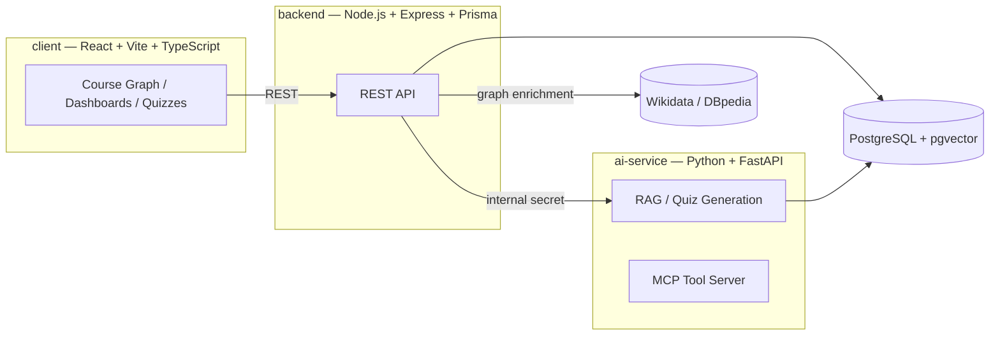

<div align="center">


### Semantic Learning Graph for Structured Course Content

Turn a flat list of topics into a guided, prerequisite-based learning path — powered by knowledge graphs (Wikidata / DBpedia) and AI-generated quizzes.

[](backend)
[](backend)
[](client)
[](client)
[](ai-service)
[](docker-compose.yml)
[](docker-compose.yml)

</div>

---

## Overview

**CampNode** is a graph-based learning platform for university courses. A professor defines the core topics of a course, and the system automatically:

1. **Fetches related concepts** from Wikidata / DBpedia
2. **Builds a semantic learning graph**, including prerequisite relationships between topics
3. **Retrieves external learning resources** (articles, videos, podcasts) for each topic
4. **Generates AI-based quizzes** per topic to check understanding

Students then explore the course as an interactive graph, unlock nodes by passing quizzes, and track their progress and learning time — instead of scrolling through an unstructured syllabus.

## Features

- **Interactive course graph** — courses are rendered as a node graph (via [React Flow](https://reactflow.dev/)) where topics unlock based on prerequisites
- **AI-assisted course creation** — professors enter a topic list and the system suggests related subtopics, sources, and structure
- **Automated quiz generation & grading** — quizzes are generated per topic and support partial credit
- **RAG-powered course Q&A** — a Python/FastAPI service ingests course PDFs and material into `pgvector` and answers student questions with sourced context, exposed both as an HTTP API and as an [MCP](https://modelcontextprotocol.io/) tool server
- **Progress & analytics dashboards** — real learning-activity tracking (time on topic, streaks, engagement) for students, and course statistics for professors
- **Public course catalog** — courses can be published and discovered by other students
- **University SSO / OAuth2 login** alongside classic email/password auth
- **Feedback loop** — students can leave feedback per topic to help professors improve content

## Architecture

CampNode is split into three services, orchestrated via Docker Compose:



| Service | Path | Stack |
|---|---|---|
| **Client** | [`client/`](client) | React 19, TypeScript, Vite, Tailwind CSS, React Flow, Recharts |
| **Backend** | [`backend/`](backend) | Node.js, Express 5, Prisma ORM, JWT auth, Helmet |
| **AI Service** | [`ai-service/`](ai-service) | Python, FastAPI, RAG pipeline, MCP server |
| **Database** | — | PostgreSQL 16 with `pgvector` for embeddings |

The AI service is only reachable from the backend over the internal Docker network and is authenticated with a shared secret (`INTERNAL_AI_SECRET`) — it is never exposed publicly.

## Getting Started

### Prerequisites

- [Docker](https://www.docker.com/) and Docker Compose (recommended), **or**
- Node.js 20+, Python 3.11+, and a local PostgreSQL instance with the `pgvector` extension for manual setup

### Quick start with Docker Compose

```bash
# 1. Clone the repository
git clone https://github.com/Jemappellemeho/CampNode.git
cd CampNode

# 2. Configure environment variables
cp .env.example .env
# then edit .env with your own secrets/credentials

# 3. Start everything (Postgres, backend, ai-service)
docker compose up --build
```

The backend API will be available at `http://localhost:3000`, and database migrations run automatically on startup.

### Manual development setup

```bash
# Install dependencies for backend and client
npm run install:all

# Run backend + client concurrently in dev mode
npm run dev
```

The AI service needs to be started separately:

```bash
cd ai-service
pip install -r requirements.txt
cp .env.example .env   # configure AI/Supabase credentials
uvicorn app.main:app --reload --port 8001
```

Each service also ships its own `.env.example` ([`backend/.env.example`](backend/.env.example), [`client/.env.example`](client/.env.example), [`ai-service/.env.example`](ai-service/.env.example)) for standalone configuration.

## Project Structure

```
CampNode/
├── client/            React + TypeScript frontend (course graph, dashboards, quizzes)
│   └── src/
│       ├── components/
│       ├── pages/
│       └── utils/
├── backend/            Express API + Prisma ORM
│   ├── prisma/         Database schema & migrations
│   └── src/
│       ├── controllers/
│       ├── routes/
│       ├── services/
│       └── middleware/
├── ai-service/          FastAPI RAG & quiz-generation service
│   └── app/
│       ├── main.py      HTTP API (/ask, /ingest)
│       ├── rag.py        RAG pipeline
│       ├── ingest.py     Document ingestion into pgvector
│       └── mcp_server.py MCP tool server
└── docker-compose.yml   Postgres + backend + ai-service orchestration
```

## API Overview

The backend exposes a REST API under `/api`, grouped by domain:

| Prefix | Responsibility |
|---|---|
| `/api/auth` | Registration, login, refresh tokens, OAuth2/SSO |
| `/api/courses` | Course CRUD, enrollment, join codes |
| `/api/topics` | Topic content, sources, subtopics |
| `/api/quizzes` | Quiz generation, submission, grading |
| `/api/progress` | Student progress & unlock state |
| `/api/wiki` | Wikidata/Wikipedia concept enrichment |
| `/api/ai` | RAG-backed Q&A over course material |
| `/api/feedback` | Per-topic student feedback |
| `/api/statistics` | Learning-activity analytics |
| `/api/metadata` | Supporting/lookup data |

`GET /health` provides a simple liveness check.

## Contributing

Contributions are welcome. Please open an issue to discuss significant changes before submitting a pull request, and keep PRs focused on a single concern.

```bash
git checkout -b feature/your-feature
# make your changes
git commit -m "feat: describe your change"
git push origin feature/your-feature
```
