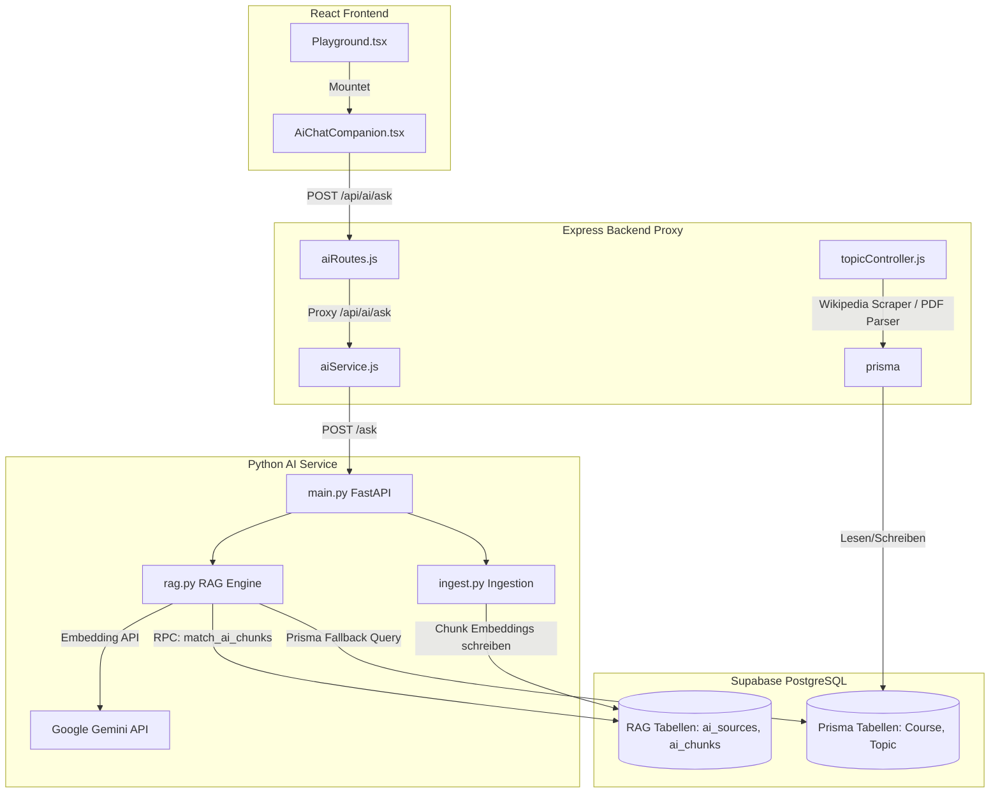
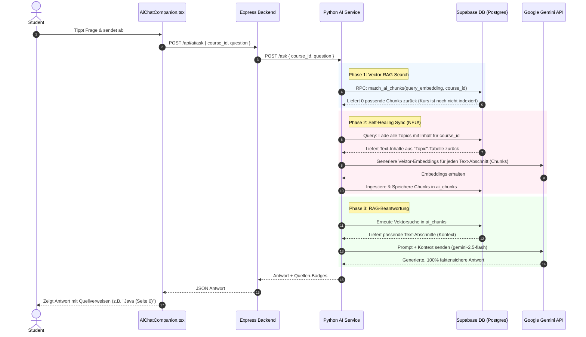

# CampNode AI RAG System - Architektur & Dokumentation

Dieses Dokument bietet eine vollständige, detaillierte Übersicht über die Architektur des **CampNode AI RAG (Retrieval-Augmented Generation) Systems**. Es erklärt den Datenfluss, die Komponenten, das Datenbankschema und das neu implementierte **Self-Healing-System** zur automatischen on-the-fly Indexierung.

---

## 🗺️ Systemarchitektur im Überblick

Das CampNode AI-System besteht aus drei Hauptschichten:
1. **Frontend (React / Vite)**: Das Benutzerinterface, auf dem Studenten lernen und mit dem AI Chat Companion interagieren.
2. **Backend Proxy (Node.js / Express / Prisma)**: Verwaltet Benutzer-Authentifizierung, Kurs-Strukturen, Wikipedia-Scraping und leitet AI-Anfragen weiter.
3. **AI Service (Python / FastAPI / Uvicorn)**: Führt die mathematische Vektorsuche (pgvector) aus, berechnet Text-Embeddings und kommuniziert mit Google Gemini.



---

## 🔄 Detaillierter Datenfluss (RAG & Self-Healing)

Wenn ein Student eine Frage stellt (z. B. *"Was ist Java ?"*), läuft das System durch eine hochentwickelte, ausfallsichere Pipeline:



---

## 🛠️ Komponenten-Aufschlüsselung

### 1. Frontend: Der AI Chat Companion
* **Datei**: [AiChatCompanion.tsx](file:///Users/mehoomanovic/Desktop/Campnode/CampNode/client/src/components/AiChatCompanion.tsx)
* **Technologie**: React, TypeScript, TailwindCSS, Framer Motion (für Premium-Animationen), Lucide-React (Icons).
* **Eigenschaften**:
  * **Glassmorphism-Panel**: Edler Look mit semi-transparentem Hintergrund und Unschärfe (`backdrop-blur-xl bg-white/80 dark:bg-slate-900/85`).
  * **Smart Chips**: Generiert aus dem Kurs-Roadmap-Lernpfad dynamisch relevante Themenvorschläge als Klick-Buttons.
  * **Source Badges**: Zeigt visuell ansprechende Badges der zitierten Kursmaterialien mit einem Buch-Icon an.
  * **Typing Indicator**: Schimmerndes Lade-Element, während die AI nachdenkt.

### 2. Python AI Service: Die RAG- & Ingestion-Engine
* **Framework**: FastAPI (schnell, typisiert und asynchron).
* **Dateien**:
  * [main.py](file:///Users/mehoomanovic/Desktop/Campnode/CampNode/ai-service/app/main.py): Exponiert `/ask` (Fragen beantworten) und `/ingest` (Kursmaterialien indexieren).
  * [rag.py](file:///Users/mehoomanovic/Desktop/Campnode/CampNode/ai-service/app/rag.py): Berechnet Embeddings, führt die Vektorsuche durch und enthält das **Self-Healing-System**.
  * [ingest.py](file:///Users/mehoomanovic/Desktop/Campnode/CampNode/ai-service/app/ingest.py): Zerteilt lange Quelltexte in mundgerechte Chunks (standardmäßig 150 Wörter), berechnet die Embeddings und speichert sie in der Datenbank.
  * [prompts.py](file:///Users/mehoomanovic/Desktop/Campnode/CampNode/ai-service/app/prompts.py): System- und User-Prompts, die strikte Halluzinations-Schutzregeln definieren.

---

## 💾 Datenbankschema & Vektorsuche

Die RAG-Tabellen liegen direkt im PostgreSQL-Schema von Supabase und nutzen die `pgvector`-Erweiterung für mathematische Ähnlichkeitsberechnungen.

### 1. Quellentabelle (`ai_sources`)
Speichert die Metadaten der hochgeladenen Dokumente, Wikipedia-Artikel oder PDFs.
```sql
CREATE TABLE ai_sources (
    id UUID PRIMARY KEY DEFAULT gen_random_uuid(),
    course_id VARCHAR(255) NOT NULL,
    title VARCHAR(255) NOT NULL,
    source_type VARCHAR(50) DEFAULT 'text',
    url VARCHAR(500),
    approved BOOLEAN DEFAULT TRUE,
    created_at TIMESTAMP WITH TIME ZONE DEFAULT timezone('utc'::text, now())
);
```

### 2. Vektortabelle (`ai_chunks`)
Speichert die einzelnen Textabschnitte und ihre hochdimensionalen Vektoren (Größe 768 für das Gemini-Modell).
```sql
CREATE TABLE ai_chunks (
    id UUID PRIMARY KEY DEFAULT gen_random_uuid(),
    course_id VARCHAR(255) NOT NULL,
    source_id UUID REFERENCES ai_sources(id) ON DELETE CASCADE,
    content TEXT NOT NULL,
    chunk_index INT NOT NULL,
    page_number INT DEFAULT 0,
    embedding VECTOR(768), -- Vektor-Dimension für gemini-embedding-001
    created_at TIMESTAMP WITH TIME ZONE DEFAULT timezone('utc'::text, now())
);
```

### 3. Vektorsuche RPC-Funktion (`match_ai_chunks`)
Berechnet das Kosinus-Ähnlichkeitsmaß zwischen dem Vektor der Frage und den abgespeicherten Chunks in PostgreSQL.
```sql
CREATE OR REPLACE FUNCTION match_ai_chunks (
  query_embedding vector(768),
  match_count int,
  p_course_id varchar
)
RETURNS TABLE (
  id uuid,
  content text,
  title varchar,
  page_number int,
  similarity float
)
LANGUAGE plpgsql
AS $$
BEGIN
  RETURN QUERY
  SELECT
    c.id,
    c.content,
    s.title,
    c.page_number,
    1 - (c.embedding <=> query_embedding) AS similarity -- Kosinus-Ähnlichkeit
  FROM ai_chunks c
  JOIN ai_sources s ON c.source_id = s.id
  WHERE c.course_id = p_course_id
  ORDER BY c.embedding <=> query_embedding
  LIMIT match_count;
END;
$$;
```

---

## 🛡️ Halluzinationsschutz & Sicherheit

Das CampNode-System ist darauf ausgelegt, zu **100 % faktensicher** zu antworten. Dies wird durch zwei Mechanismen garantiert:

1. **Striktes Prompting**: Das `ANSWER_PROMPT` verbietet dem LLM das Erfinden von Antworten.
   > *"Answer only using the provided context. If the context is not enough, say that the course material does not contain enough information. Do not invent facts."*
2. **Präzise Quellenangaben**: Jede Antwort liefert ein Array von `sources` (z. B. `["Java (Seite 0)"]`), welche direkt aus dem indexierten Dokumentennamen und dem Chunk-Index berechnet werden. Das Frontend stellt diese Quellen transparent dar.

---

## 🚀 Das neue Self-Healing-System (Daten-Synchronisation)

### Das Problem
Wenn Professoren Themen anlegten (z.B. durch Scraping von Wikipedia oder Importieren von Texten), passierte dies in der Prisma-Datenbank. War der Python AI-Service zu dem Zeitpunkt offline, fehlten die Embeddings in den Vektortabellen. Studenten sahen eine leere Antwort ("Im verfügbaren Kursmaterial gibt es dazu nicht genug Informationen"), obwohl die Texte in der Hauptdatenbank lagen.

### Die Lösung
In [rag.py](file:///Users/mehoomanovic/Desktop/Campnode/CampNode/ai-service/app/rag.py) haben wir folgendes robustes **Self-Healing** integriert:
```python
# Falls keine Chunks in den Vektor-Tabellen gefunden werden
if not chunks:
    try:
        # Lade alle echten Textinhalte des Kurses aus der "Topic"-Tabelle von Prisma/Supabase
        topics_response = supabase.table("Topic").select("name, content").eq("courseId", course_id).not_.is_("content", "null").execute()
        topics_data = topics_response.data
        
        if topics_data:
            # Indexiere die Inhalte on-the-fly in die Vektortabellen!
            from .ingest import ingest_course_material
            for topic in topics_data:
                if topic.get("content") and topic.get("content").strip():
                    ingest_course_material(course_id, topic["name"], topic["content"])
            
            # Führe die Vektorsuche erneut aus
            chunks = search_chunks(course_id, question, limit=3)
    except Exception as e:
        print(f"[RAG-Self-Healing] Error: {e}")
```
**Ergebnis**: Das System repariert sich beim ersten Fragen eines Studenten vollautomatisch selbst! Ab dem zweiten Aufruf greift das System blitzschnell auf die bereits berechneten Cache-Vektoren zu.
